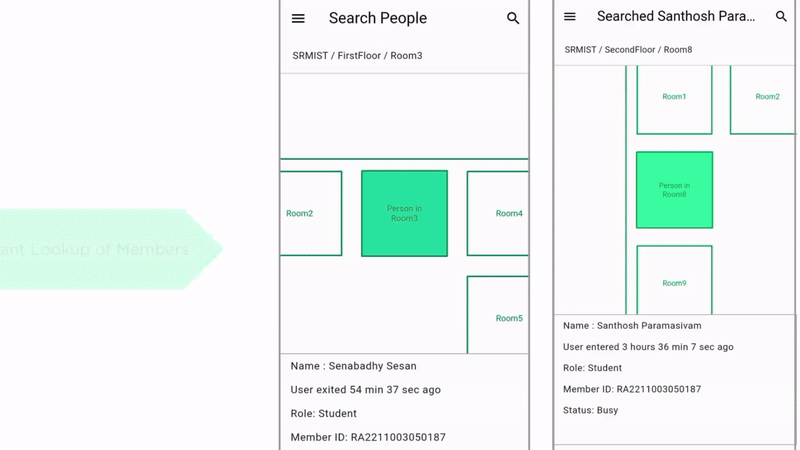
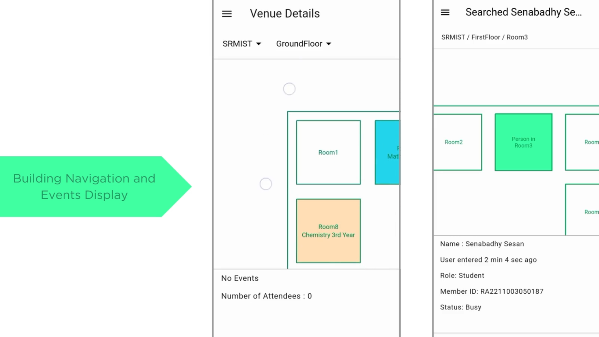
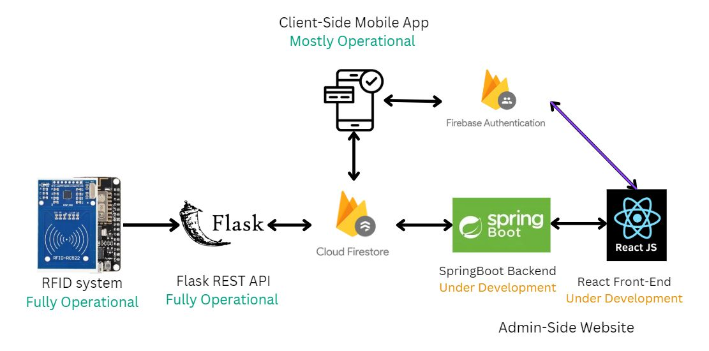

# CampusFind

A cross-platform mobile app to locate particular individuals across large campuses

## Motivation

After having to spend hours looking for professors and heads of departments
on busy days for signatures and permissions across my huge then-college campus, 
I created an app where you can look up the location of individuals in an institution 
with only a couple of taps on your mobile device!

## Quick Start

A download link is currently unavailable!

This is because institutions are registered and users are added through the **CampusFind Admin Website**, which is currently under development.

In the meantime, feel free to check out its video demos on youtube:

### CampusFind Demo #2

### CampusFind IoT Demo (#3)

[)](https://www.youtube.com/watch?v=4jW771IBFp0)

## CampusFind offers a seamless way to

- **Instantly locate colleagues**: View real-time, interactive floor maps that guide you directly to your colleagues’ locations.
- **Set and update your location**: Easily share your whereabouts with others so they know where to find you.
- **View events and attendees**: See who's in each room or meeting space, and what events are taking place.
- **Utilize RFID stations**: Automate check-ins and check-outs for quick and efficient tracking of locations.
- **Display your availability**: Let others know when you’re available or busy, fostering more respectful and efficient collaboration.

## Project Architecture

### Github links to components

- The current repository contains code for the client-side mobile app
- [RFID-Station-Arduino](https://github.com/Santhosh-Paramasivam/CampusFind-RFIDStation)
- [RFID-Flask-Backend](https://github.com/Santhosh-Paramasivam/campusfind-checkin-backend)
- [CampusFind-Admin-Backend](https://github.com/Santhosh-Paramasivam/CampusFind-Admin_Backend)
- [CampusFind-Admin-Frontend](https://github.com/Santhosh-Paramasivam/CampusFind-Admin_Backend)

## Contact

[LinkedIn](www.linkedin.com/in/santhosh-paramasivam-2a430a267)

Submit an issue here on Github
